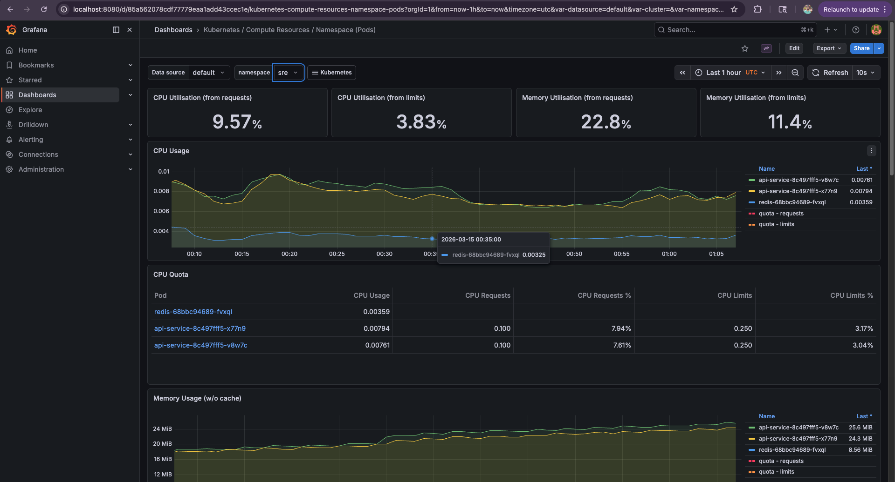
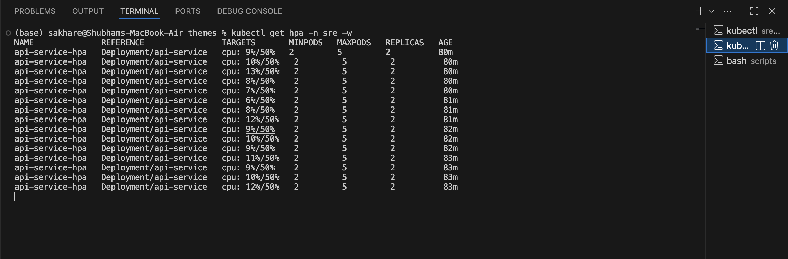
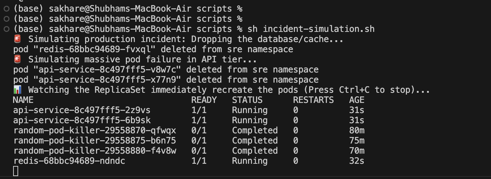
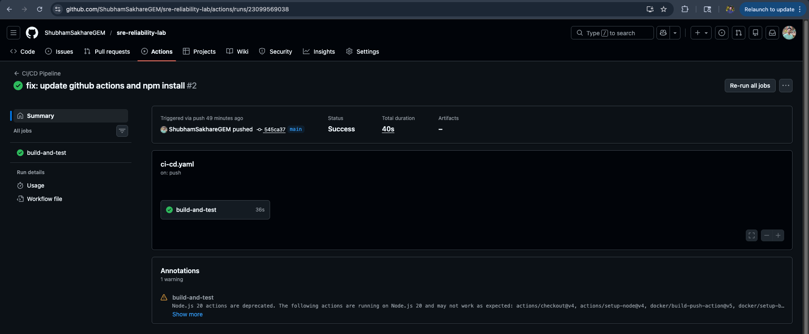

# SRE Reliability Lab

I built a complete, local reliability engineering lab to simulate a production microservice environment. I made sure that the project covers core Site Reliability Engineering (SRE) practices including container orchestration, observability, auto-scaling and chaos engineering.

## System Visualizations

### 1. Observability (Prometheus & Grafana)
*Real-time monitoring of cluster compute resources during a simulated traffic spike.*


### 2. Auto-Scaling (Horizontal Pod Autoscaler)
*Kubernetes dynamically scaling API replicas from 2 to 5 in response to CPU load.*


### 3. Chaos Engineering & Self-Healing
*The Kubernetes ReplicaSet instantly recovering from a simulated massive pod failure.*


### 4. Continuous Integration
*Automated GitHub Actions pipeline linting and building the Docker container on push.*


## Architecture

* **Application:** Node.js Express API exposing Prometheus metrics.
* **Cache:** Redis for simulating backend state/caching.
* **Orchestration:** Kubernetes (Local via `kind`), simulating OpenShift environments.
* **Observability Stack:** Prometheus (Metrics) and Grafana (Dashboards).
* **Automation:** GitHub Actions (CI) and ArgoCD (GitOps CD).

## Setup Instructions (Mac M1/Apple Silicon)

**Prerequisites:** Docker Desktop (or Colima), `kind`, `kubectl`, `helm`.

### 1. Provision the Infrastructure
```bash
make cluster
make build
make load
make deploy
```

### 2. Install the Observability Stack
```bash
helm repo add prometheus-community [https://prometheus-community.github.io/helm-charts](https://prometheus-community.github.io/helm-charts)
helm repo update
helm install prometheus prometheus-community/kube-prometheus-stack --namespace monitoring
```

### 3. Install the Metrics Server (For Auto-scaling)
```bash
helm repo add metrics-server [https://kubernetes-sigs.github.io/metrics-server/](https://kubernetes-sigs.github.io/metrics-server/)
helm repo update
helm install metrics-server metrics-server/metrics-server --namespace kube-system --set args={--kubelet-insecure-tls}
```

## Reliability Features Demonstrated


### 1. Observability (Monitoring & Alerting)
The service exposes standard Node.js metrics and custom HTTP request counters. The Prometheus stack scrapes /metrics automatically via a ServiceMonitor.

API Metrics: kubectl port-forward svc/api-service 3000:80 -n sre (Visit http://localhost:3000/metrics)

Grafana Dashboards: kubectl port-forward svc/prometheus-grafana 8080:80 -n monitoring (Visit http://localhost:8080)

To get the auto-generated Grafana password: 
```bash
kubectl get secret prometheus-grafana -n monitoring -o jsonpath="{.data.admin-password}" | base64 --decode ; echo
```

### 2. Auto-Scaling (HPA)
The API deployment defines strict CPU and Memory requests. A Horizontal Pod Autoscaler monitors CPU utilization and dynamically scales the pods between 2 and 5 replicas.

Watch the scaler: 
```bash
kubectl get hpa -n sre -w
```

Trigger the load: 
```bash
sh scripts/load-test.sh
```

### 3. Self-Healing & Chaos Engineering
A native Kubernetes CronJob acts as a Chaos Monkey, aggressively terminating pods to test the ReplicaSet's ability to maintain the desired state.

Simulate an incident: 
```bash
sh scripts/incident-simulation.sh
```

### 4. GitOps & CI/CD
Continuous Integration: GitHub Actions automatically lints dependencies and builds the Docker image on every push to the main branch.

## Continuous Deployment: 
Infrastructure manifests are managed declaratively. In a full GitOps workflow, ArgoCD continuously monitors the repository and automatically syncs changes to the cluster to prevent configuration drift.

## Lessons Learned:
Resource Limits: The HPA fails silently if CPU/Memory requests are not explicitly defined in the deployment template and if a metrics server is not present in the cluster.

## Architecture Constraints: 
Running a local Kubernetes cluster on Apple Silicon (arm64) requires careful handling of image pull policies (imagePullPolicy: Never) to prevent architecture mismatches with public container registries.
